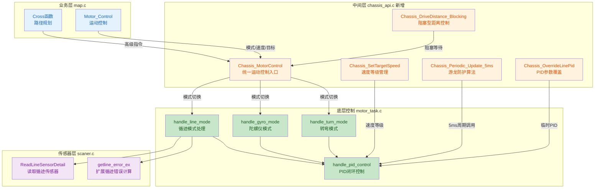

## 1. 高层摘要 (TL;DR)

*   **影响范围：** 🔴 **高** - 这是一次重大的架构重构，涉及底盘控制系统的彻底解耦
*   **核心变更：**
    *   ✨ 新增 `chassis_api.c/h` 中间件层，实现地图层与底层控制的彻底解耦
    *   🗑️ 删除 `speed_ctrl.c/h` 模块，功能迁移至新的API层
    *   🔄 重构 `map.c`、`scaner.c`、`motor_task.c` 等核心文件，使用新的API接口
    *   📝 添加 `Refactoring_Guide.md` 重构指南文档

---

## 2. 可视化概览 (代码与逻辑映射)



---

## 3. 详细变更分析

### 📦 **新增组件：底盘API中间层**

#### **Application/chassis_api.h** (新增)
*   **变更说明：** 定义了全新的底盘控制API接口，实现彻底解耦设计
*   **关键特性：**
    *   引入 `LineTrackMode_e` 枚举，定义循迹模式（双边、左边缘、右边缘、流水）
    *   重新定义 `struct Motors` 结构体，包含速度、PID参数、里程等信息
    *   提供高级接口函数（共30+个），包括：
        *   初始化与模式控制：`Chassis_Init()`, `Chassis_SetMode()`, `Chassis_SetTargetSpeed()`
        *   运动控制：`Chassis_MotorControl()`, `Chassis_DriveDistance_Blocking()`
        *   PID管理：`Chassis_OverrideLinePid()`, `Chassis_RestoreLinePid()` 等
        *   阻塞型接口：`Chassis_TurnToAngle_Blocking()`, `Chassis_MoveDistance_Blocking()`

#### **Application/chassis_api.c** (新增)
*   **变更说明：** 实现底盘API中间件，封装底层控制逻辑
*   **核心实现：**
    *   **状态管理：** 使用 `ChassisState_t` 结构体管理底盘内部状态（PID模式、循迹模式、游龙防护等）
    *   **速度等级映射：** 在 `Chassis_SetTargetSpeed()` 中根据速度等级自动设置PID参数
    *   **游龙防护算法：** 在 `Chassis_Periodic_Update_5ms()` 中实现5ms周期的自适应PID调整
    *   **模式切换：** `pid_mode_switch()` 函数实现PID模式间的平滑切换
    *   **刹车控制：** `CarBrake()` 和 `Chassis_Brake()` 提供安全的急刹功能

### 🗑️ **删除组件：speed_ctrl模块**

#### **Motor/speed_ctrl.c** (删除)
*   **变更说明：** 删除原有的速度控制模块
*   **移除内容：**
    *   `motor_all` 全局变量定义
    *   `CarBrake()` 函数
    *   `gradual_cal()` 函数
    *   `CarBrake_Stop()` 函数

#### **Motor/speed_ctrl.h** (删除)
*   **变更说明：** 删除速度控制头文件
*   **移除内容：**
    *   `struct Motors` 结构体定义
    *   速度宏定义（SPEED0~SPEED5）
    *   函数声明

### 🔄 **重构核心文件**

#### **Application/map.c**
*   **变更说明：** 大幅重构地图导航逻辑，使用新的API接口
*   **主要变更：**
    *   **头文件替换：** `#include "speed_ctrl.h"` → `#include "chassis_api.h"`
    *   **注释修复：** 将乱码注释修复为清晰的中文注释
    *   **新增辅助函数：**
        | 函数名 | 功能 |
        |--------|------|
        | `GetForwardDistanceBeforeTurn()` | 获取转弯前的前进距离判断 |
        | `GetForwardDistanceBeforeGyroTurn()` | 获取陀螺仪不停车转弯前的距离 |
        | `Check_And_Apply_SpeedUp()` | 特定直线路径加速判断 |
        | `Handle_NoTurn_StraightPath()` | 无需转弯时的特例直行处理 |
    *   **简化Motor_Control函数：**
        ```c
        // 旧代码：66行switch-case逻辑
        void Motor_Control(uint8_t target_mode,float LSPEED,float RSPEED,float aim) {
            switch(target_mode) {
                case is_Turn: { Turn_Angle_Relative(aim); break; }
                case is_Line: { /* 复杂逻辑 */ break; }
                // ... 更多case
            }
        }
        
        // 新代码：1行调用
        void Motor_Control(uint8_t target_mode,float LSPEED,float RSPEED,float aim) {
            Chassis_MotorControl(target_mode, LSPEED, RSPEED, aim);
        }
        ```
    *   **删除函数声明：** 移除 `Want2Go()` 函数声明（已迁移到chassis_api）

#### **Application/scaner.c**
*   **变更说明：** 重构循迹传感器读取和错误计算逻辑
*   **主要变更：**
    *   **头文件替换：** `#include "speed_ctrl.h"` → `#include "chassis_api.h"`
    *   **新增函数：**
        ```c
        static uint16_t ReadLineSensorDetail(void) {
            // 封装GPIO读取逻辑，返回16位传感器状态
            uint16_t detail = 0XFFFF;
            detail ^= ((HAL_GPIO_ReadPin(GPIOE, GPIO_PIN_14)) << 15);
            // ... 其他传感器
            return detail;
        }
        ```
    *   **重构getline_error函数：**
        ```c
        // 旧代码：直接读取和处理
        uint8_t getline_error(void) {
            // 30+行GPIO读取和处理逻辑
            Line_Scan(&Scaner, Lamp_Max, scaner_set.EdgeIgnore);
            if(ScanerMode == Gray) { /* 灰度处理 */ }
        }
        
        // 新代码：调用扩展函数
        uint8_t getline_error(void) {
            getline_error_ex(&Scaner, scaner_set.EdgeIgnore, LEFT_RIGHT_LINE);
            return 0;
        }
        ```
    *   **新增getline_error_ex函数：** 支持自定义SCANER对象、边缘忽略、循迹模式
    *   **扩展Line_Scan函数签名：** 添加 `track_mode` 参数
    *   **扩展value_calculation函数签名：** 添加 `track_mode` 参数，支持强制循迹模式

#### **Task/motor_task.c**
*   **变更说明：** 重构电机任务，集成底盘API
*   **主要变更：**
    *   **头文件替换：** `#include "speed_ctrl.h"` → `#include "chassis_api.h"`
    *   **初始化调用：** 在 `motor_task()` 中添加 `Chassis_Init()`
    *   **重构handle_mode_switch函数：**
        ```c
        // 旧签名
        void handle_mode_switch(void);
        
        // 新签名：传入目标模式
        void handle_mode_switch(uint8_t target_mode);
        ```
    *   **优化模式切换逻辑：** 使用静态变量记录上次模式，实现平滑切换
    *   **更新getline_error调用：** 使用新的 `getline_error_ex()` 接口
    *   **添加周期更新调用：** 在5ms循环末尾调用 `Chassis_Periodic_Update_5ms()`

#### **Task/motor_task.h**
*   **变更说明：** 更新枚举类型和函数声明
*   **主要变更：**
    *   **枚举类型修改：**
        ```c
        // 旧代码
        enum PID_Mode { is_No, is_Free, is_Line, is_Turn, is_Gyro, is_sp };
        
        // 新代码
        typedef enum { is_No, is_Free, is_Line, is_Turn, is_Gyro } PID_Mode;
        ```
    *   **删除未使用枚举值：** 移除 `is_sp`
    *   **更新函数声明：** `handle_mode_switch(uint8_t target_mode)`

#### **Application/barrier.c**
*   **变更说明：** 更新头文件引用和函数实现
*   **主要变更：**
    *   **头文件替换：** `#include "speed_ctrl.h"` → `#include "chassis_api.h"`
    *   **简化Motor_Control函数：** 调用 `Chassis_MotorControl()`
    *   **删除Want2Go函数：** 移至chassis_api.c

#### **Application/barrier.h**
*   **变更说明：** 删除已迁移的函数声明
*   **主要变更：** 移除 `void Want2Go(float Dis);` 声明

#### **Application/gray.c**
*   **变更说明：** 更新头文件引用
*   **主要变更：** `#include "speed_ctrl.h"` → `#include "chassis_api.h"`

#### **Application/turn.c**
*   **变更说明：** 更新头文件引用
*   **主要变更：** `#include "speed_ctrl.h"` → `#include "chassis_api.h"`

### 📚 **新增文档**

#### **Refactoring_Guide.md** (新增)
*   **变更说明：** 添加详细的重构指南文档
*   **文档内容：**
    *   重构背景和三大痛点分析
    *   四阶段实施步骤：
        1. 修复底层基石（编码器与FPU运算）
        2. 启用中间件chassis_api
        3. motor_task.c的"纯粹化"改造
        4. map.c的终极瘦身
    *   重构后的代码流向图
    *   开发者自检清单

---

## 4. API接口变更表

| 旧接口 | 新接口 | 变更类型 | 说明 |
|--------|--------|----------|------|
| `speed_ctrl.h` | `chassis_api.h` | 替换 | 完全替换头文件 |
| `motor_all` (speed_ctrl) | `motor_all` (chassis_api) | 迁移 | 全局变量定义迁移 |
| `CarBrake()` (speed_ctrl) | `CarBrake()` (chassis_api) | 迁移 | 函数实现迁移 |
| `gradual_cal()` (speed_ctrl) | `gradual_cal()` (chassis_api) | 迁移 | 函数实现迁移 |
| `Want2Go()` (barrier) | `Chassis_MoveDistance_Blocking()` | 升级 | 阻塞型距离控制接口 |
| 直接修改 `line_pid_param` | `Chassis_OverrideLinePid()` | 封装 | PID参数覆盖接口 |
| 直接修改 `gyroT_pid_param` | `Chassis_OverrideTurnPid()` | 封装 | 转弯PID参数覆盖接口 |
| `Motor_Control()` (内部实现) | `Chassis_MotorControl()` | 统一 | 统一运动控制入口 |
| `getline_error()` | `getline_error_ex()` | 扩展 | 支持自定义参数的扩展版本 |
| `Line_Scan(...)` | `Line_Scan(..., track_mode)` | 扩展 | 添加循迹模式参数 |
| `value_calculation(...)` | `value_calculation(..., track_mode)` | 扩展 | 添加循迹模式参数 |

---

## 5. 影响与风险评估

### ⚠️ **破坏性变更**

1.  **头文件引用变更：** 所有引用 `speed_ctrl.h` 的文件必须改为 `chassis_api.h`
2.  **函数签名变更：** `handle_mode_switch()` 现在需要传入 `target_mode` 参数
3.  **枚举类型变更：** `PID_Mode` 从 `enum` 改为 `typedef enum`，移除了 `is_sp` 值
4.  **全局变量位置变更：** `motor_all` 现在定义在 `chassis_api.c` 中

### 🧪 **测试建议**

1.  **基础功能测试：**
    *   ✅ 验证底盘初始化 `Chassis_Init()` 是否正确初始化所有状态
    *   ✅ 测试各种运动模式（循迹、陀螺仪、转弯、自由模式）切换是否正常
    *   ✅ 验证速度等级设置 `Chassis_SetTargetSpeed()` 是否正确映射PID参数

2.  **循迹功能测试：**
    *   ✅ 测试不同循迹模式（双边、左边缘、右边缘、流水）是否正常工作
    *   ✅ 验证 `getline_error_ex()` 是否正确计算循迹误差
    *   ✅ 测试游龙防护算法是否在5ms周期内有效抑制震荡

3.  **运动控制测试：**
    *   ✅ 测试阻塞型接口 `Chassis_DriveDistance_Blocking()` 是否正确行驶指定距离
    *   ✅ 测试转弯接口 `Chassis_TurnToAngle_Blocking()` 是否准确到达目标角度
    *   ✅ 验证PID参数覆盖和恢复机制是否正常工作

4.  **集成测试：**
    *   ✅ 在完整地图路径上测试小车导航是否正常
    *   ✅ 验证模式切换时的平滑过渡（循迹↔陀螺仪）
    *   ✅ 测试急刹功能 `Chassis_Brake()` 是否安全可靠

5.  **性能测试：**
    *   ✅ 验证5ms周期循环是否稳定运行
    *   ✅ 检查CPU占用率是否在可接受范围内
    *   ✅ 测试编码器测速精度是否提升（参考Refactoring_Guide.md中的差值法）

### 📋 **迁移检查清单**

- [ ] 所有源文件已将 `#include "speed_ctrl.h"` 替换为 `#include "chassis_api.h"`
- [ ] `Motor/speed_ctrl.c` 和 `Motor/speed_ctrl.h` 已从项目中移除
- [ ] `handle_mode_switch()` 调用处已添加 `target_mode` 参数
- [ ] 所有直接修改 `line_pid_param` 的代码已替换为 `Chassis_OverrideLinePid()`
- [ ] 所有直接修改 `gyroT_pid_param` 的代码已替换为 `Chassis_OverrideTurnPid()`
- [ ] `Want2Go()` 调用已替换为 `Chassis_MoveDistance_Blocking()`
- [ ] `getline_error()` 调用已根据需要更新为 `getline_error_ex()`
- [ ] `motor_task.c` 中已添加 `Chassis_Init()` 调用
- [ ] `motor_task.c` 中已添加 `Chassis_Periodic_Update_5ms()` 调用
- [ ] 编译无错误和警告

---

## 6. 总结

本次重构是一次**架构级别的重大改进**，通过引入 `chassis_api` 中间层，实现了：

1.  **彻底解耦：** 地图层（map.c）不再直接操作底层PID参数，通过高级API接口控制底盘
2.  **代码复用：** 将重复的PID参数设置、模式切换逻辑封装到中间层
3.  **可维护性提升：** 底层控制逻辑集中在 `chassis_api.c`，便于统一管理和优化
4.  **扩展性增强：** 新的API接口设计清晰，便于后续添加新功能

重构遵循了**"让上帝的归上帝，让凯撒的归凯撒"**的设计原则，使代码结构更加清晰、职责更加明确。建议按照 `Refactoring_Guide.md` 中的自检清单进行验证，确保重构的正确性和完整性。